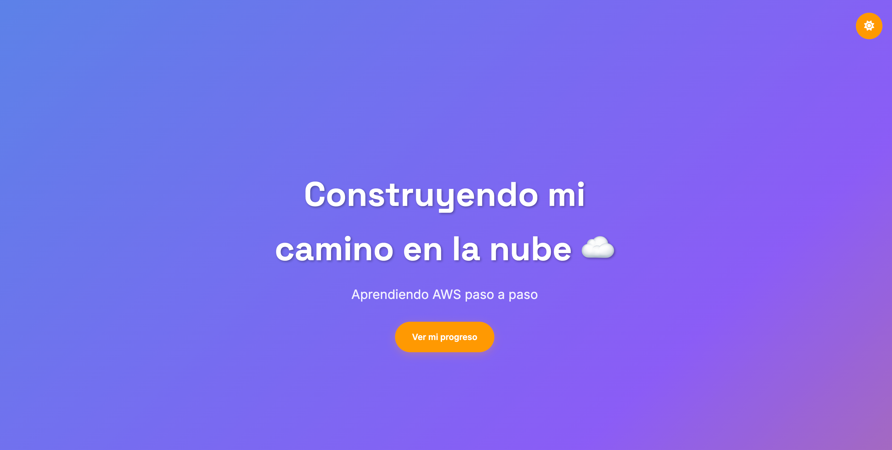

# 🚀 Challenge AWS Cloud Practitioner Web

Una colección de sitios web modernos y motivadores diseñados especialmente para estudiantes que están comenzando su viaje en AWS Cloud Practitioner. Este repositorio contiene diferentes modelos de páginas web que puedes usar como inspiración o punto de partida para tus proyectos.

## 🎯 Objetivo del Repositorio

- **Inspirar** a estudiantes con ejemplos profesionales y modernos
- **Educar** con código limpio, comentado y fácil de entender
- **Demostrar** mejores prácticas de desarrollo web y despliegue en la nube
- **Facilitar** el aprendizaje práctico de AWS y desarrollo web

## 📁 Modelos de Sitios Web Disponibles

### 1. 🌟 **Básico** (`/basico/`)
Página web motivadora con efectos interactivos y panel de metadata inteligente.

<div align="center">


*Modelo básico con gradiente animado y panel de metadata inteligente*

</div>

**Características:**
- Diseño futurista con gradientes animados
- Panel de metadata que detecta el entorno (localhost/internet/AWS)
- Efectos de partículas y confeti interactivos
- Guía de despliegue contextual integrada
- Información de red en tiempo real (IP pública, ubicación, zona AWS)

**Archivos:**
- `index.html` - Estructura principal
- `styles.css` - Estilos y animaciones
- `script.js` - Funcionalidad interactiva avanzada

### 2. 🎨 **Portfolio** (`/porfolio/`)
Portfolio personal profesional para consultores AWS Cloud principiantes.

<div align="center">


*Portfolio profesional para consultores AWS Cloud*

</div>

**Características:**
- Diseño responsive mobile-first
- Paleta de colores oficial AWS
- Timeline de aprendizaje interactivo
- Secciones: Hero, Sobre mí, Aprendizaje, Proyectos, Contacto
- Modo oscuro/claro persistente
- Formulario de contacto con validación

**Archivos:**
- `index.html` - Sitio completo (HTML, CSS, JS embebidos)
- `README.md` - Documentación específica del portfolio

### 3. 🚧 **Coming Soon** (`/coming-soon/`)
Página de "próximamente" elegante con video de fondo.

<div align="center">


*Página "Coming Soon" elegante con video de fondo*

</div>

**Características:**
- Video de fondo profesional
- Diseño minimalista y elegante
- Formulario de suscripción
- Integración con Bootstrap
- Iconos Font Awesome

**Archivos:**
- `index.html` - Página principal
- `css/styles.css` - Estilos personalizados
- `js/scripts.js` - Funcionalidad JavaScript
- `assets/` - Recursos multimedia

### 4. 🛠️ **Scripts de Ejemplo** (`/script-example/`)
Scripts de automatización para despliegue en servidores web.

**Contenido:**
- Scripts para Nginx en Amazon Linux y Ubuntu
- Configuraciones de servidor web optimizadas
- Automatización de despliegue

## 🛠️ Tecnologías Utilizadas

- **HTML5**: Estructura semántica y accesible
- **CSS3**: Animaciones, gradientes y diseño responsive
- **JavaScript Vanilla**: Interactividad sin frameworks
- **Google Fonts**: Tipografía moderna
- **Bootstrap**: Framework CSS (en algunos modelos)
- **Font Awesome**: Iconografía profesional

## 🚀 Cómo Usar Localmente

### Opción 1: Servidor Local Simple
```bash
# Navegar a cualquier carpeta de modelo
cd basico/
# o
cd porfolio/
# o  
cd coming-soon/

# Iniciar servidor local con Python
python3 -m http.server 8080

# Abrir en navegador
open http://localhost:8080
```

### Opción 2: Abrir Directamente
```bash
# Abrir cualquier index.html directamente en el navegador
open basico/index.html
# o
open porfolio/index.html
# o
open coming-soon/index.html
```

### Opción 3: Live Server (VS Code)
1. Instala la extensión "Live Server" en VS Code
2. Abre cualquier carpeta del proyecto
3. Click derecho en `index.html` → "Open with Live Server"

## 📋 Guías de Uso por Modelo

### 🌟 Modelo Básico
**Uso recomendado:** Página de aterrizaje motivacional con detección de entorno

**Pasos:**
1. Abre `basico/index.html` en tu navegador
2. Observa el panel de metadata en la esquina superior derecha
3. Haz clic en "Haz tu primer despliegue" para ver la guía contextual
4. El sistema detectará automáticamente si estás en localhost, internet o AWS
5. Sigue los pasos específicos según tu entorno

**Características especiales:**
- Panel de metadata inteligente
- Detección automática de entorno AWS
- Guía de despliegue paso a paso
- Efectos de partículas interactivos

### 🎨 Modelo Portfolio
**Uso recomendado:** Portfolio personal profesional para consultores AWS

**Pasos:**
1. Abre `porfolio/index.html` en tu navegador
2. Personaliza la información en las secciones
3. Usa el toggle de modo oscuro/claro (esquina superior derecha)
4. Prueba el formulario de contacto
5. Navega entre secciones con scroll suave

**Personalización:**
- Edita tu información personal en el HTML
- Modifica los proyectos en la sección correspondiente
- Actualiza las habilidades AWS según tu progreso
- Consulta `porfolio/README.md` para instrucciones detalladas

### 🚧 Modelo Coming Soon
**Uso recomendado:** Página de "próximamente" para proyectos en desarrollo

**Pasos:**
1. Abre `coming-soon/index.html` en tu navegador
2. Personaliza el mensaje y la fecha de lanzamiento
3. Configura el formulario de suscripción
4. Reemplaza el video de fondo en `assets/mp4/`

**Personalización:**
- Edita el texto principal en `index.html`
- Modifica estilos en `css/styles.css`
- Cambia la funcionalidad en `js/scripts.js`

## ☁️ Despliegue en AWS

### Opción 1: S3 Static Website Hosting (Recomendado)
```bash
# 1. Crear bucket S3
aws s3 mb s3://mi-sitio-aws-2025

# 2. Configurar hosting estático
aws s3 website s3://mi-sitio-aws-2025 \
  --index-document index.html \
  --error-document index.html

# 3. Subir archivos (desde cualquier carpeta de modelo)
aws s3 sync basico/ s3://mi-sitio-aws-2025/
# o
aws s3 sync porfolio/ s3://mi-sitio-aws-2025/
# o
aws s3 sync coming-soon/ s3://mi-sitio-aws-2025/

# 4. Configurar permisos públicos
aws s3api put-bucket-policy \
  --bucket mi-sitio-aws-2025 \
  --policy '{
    "Version": "2012-10-17",
    "Statement": [{
      "Sid": "PublicReadGetObject",
      "Effect": "Allow",
      "Principal": "*",
      "Action": "s3:GetObject",
      "Resource": "arn:aws:s3:::mi-sitio-aws-2025/*"
    }]
  }'
```

### Opción 2: EC2 con Nginx (Avanzado)

**📖 Para una guía completa paso a paso, consulta:**
**[🚀 MANUAL-EC2-DEPLOYMENT.md](./MANUAL-EC2-DEPLOYMENT.md)** - Manual completo de despliegue en EC2

**Resumen rápido:**
```bash
# 1. Conectar a tu instancia EC2
ssh -i tu-key.pem ec2-user@tu-ip-publica

# 2. Usar scripts de automatización incluidos
cd /tmp
git clone https://github.com/tu-usuario/challenge-cloud-practioner-web.git
cd challenge-cloud-practioner-web/script-example/nginx-web/

# 3. Ejecutar script según tu OS
# Para Amazon Linux 2023:
sudo bash amazon-linux-2023/deploy.sh

# Para Ubuntu:
sudo bash ubuntu/deploy.sh
```

## 🎯 Funcionalidades por Modelo

### 🌟 Modelo Básico - Características Avanzadas
- **Panel de Metadata Inteligente**: Detección automática de entorno
- **Información de Red**: IP pública, IP local, geolocalización
- **Detección AWS**: Zona de disponibilidad y región en EC2
- **Guía Contextual**: Pasos específicos según el entorno detectado
- **Efectos Interactivos**: Partículas, confeti y animaciones

### 🎨 Modelo Portfolio - Características Profesionales
- **Diseño Responsive**: Mobile-first con breakpoints optimizados
- **Modo Oscuro/Claro**: Toggle persistente con localStorage
- **Timeline Interactivo**: Progreso de aprendizaje AWS visualizado
- **Formulario Funcional**: Validación y animaciones de éxito
- **Scroll Suave**: Navegación fluida entre secciones

### 🚧 Modelo Coming Soon - Características Multimedia
- **Video de Fondo**: Reproducción automática y optimizada
- **Formulario de Suscripción**: Captura de leads elegante
- **Diseño Minimalista**: Enfoque en el mensaje principal
- **Integración Bootstrap**: Framework CSS profesional

## 🎨 Personalización Rápida

### Modelo Básico
```css
/* Cambiar colores del gradiente en basico/styles.css */
background: linear-gradient(-45deg, #667eea, #764ba2, #f093fb, #f5576c);
```

```html
<!-- Cambiar mensaje en basico/index.html -->
<h1 class="main-title">¡Tu mensaje personalizado!</h1>
<p class="subtitle">Tu subtítulo motivador 🚀</p>
```

### Modelo Portfolio
```css
/* Cambiar paleta AWS en porfolio/index.html */
:root {
    --aws-orange: #FF9900;
    --aws-blue: #232F3E;
    --aws-light-blue: #4A90E2;
}
```

```html
<!-- Personalizar información en porfolio/index.html -->
<p class="about-text">Tu historia personal aquí...</p>
<span class="skill-badge">Tu Skill AWS</span>
```

### Modelo Coming Soon
```html
<!-- Cambiar mensaje en coming-soon/index.html -->
<h1 class="text-uppercase">Tu proyecto próximamente</h1>
<p class="text-white-50 mb-0">Descripción de tu proyecto</p>
```

## 🔧 Características Técnicas

### Performance Optimizada
- **CSS Animations**: Uso eficiente de transformaciones GPU
- **Lazy Loading**: Carga diferida de recursos multimedia
- **Minificación**: Código optimizado para producción
- **Responsive Images**: Adaptación automática de imágenes

### Accesibilidad Web
- **Navegación por Teclado**: Soporte completo para usuarios con discapacidades
- **Contrastes WCAG**: Cumplimiento de estándares de accesibilidad
- **Estructura Semántica**: HTML5 semántico para lectores de pantalla
- **Alt Text**: Descripciones alternativas para imágenes

### Compatibilidad Cross-Browser
- **Navegadores Modernos**: Chrome, Firefox, Safari, Edge
- **Responsive Design**: Adaptación a todos los dispositivos
- **Progressive Enhancement**: Funcionalidad básica sin JavaScript
- **Fallbacks**: Alternativas para funciones no soportadas

### Seguridad y Privacidad
- **No Tracking**: Sin cookies de seguimiento
- **APIs Públicas**: Uso responsable de servicios externos
- **Validación Client-Side**: Protección básica en formularios
- **HTTPS Ready**: Preparado para certificados SSL

## 🎓 Para Estudiantes AWS

Este repositorio es perfecto para aprender desarrollo web y AWS Cloud:

### 📚 Conceptos de Desarrollo Web
1. **HTML5 Semántico**: Estructura clara y accesible
2. **CSS3 Avanzado**: Animaciones, gradientes y responsive design  
3. **JavaScript Vanilla**: Manipulación del DOM sin frameworks
4. **Mejores Prácticas**: Código comentado y organizado

### ☁️ Conceptos de AWS Cloud
1. **S3 Static Hosting**: Hospedaje de sitios web estáticos
2. **EC2 Deployment**: Despliegue en instancias virtuales
3. **CloudFront**: Distribución global de contenido
4. **Route 53**: Gestión de dominios y DNS
5. **Certificate Manager**: Certificados SSL/TLS

### 🛠️ Tecnologías Implementadas

**Frontend Moderno:**
- CSS Grid/Flexbox para layouts responsive
- CSS Animations para efectos visuales
- Fetch API para servicios externos
- Async/Await para operaciones asíncronas
- Local Storage para persistencia de datos

**Integración AWS:**
- Detección de metadatos EC2
- APIs de geolocalización
- Scripts de automatización para despliegue
- Configuración de servidores web (Nginx/Apache)

**Características Avanzadas:**
- Detección automática de entorno (localhost/internet/AWS)
- Panel de metadata en tiempo real
- Guías contextuales de despliegue
- Validación de formularios client-side
- Optimización para SEO y performance

### 🎯 Rutas de Aprendizaje Sugeridas

**Principiante:**
1. Comienza con el **Modelo Básico** para entender conceptos fundamentales
2. Practica el despliegue local con servidor Python
3. Experimenta con personalización de colores y textos

**Intermedio:**
1. Explora el **Modelo Portfolio** para conceptos más avanzados
2. Practica despliegue en S3 Static Hosting
3. Implementa tu propio formulario de contacto

**Avanzado:**
1. Usa el **Modelo Coming Soon** con multimedia
2. Despliega en EC2 con los scripts incluidos
3. Configura CloudFront y certificados SSL
4. Implementa CI/CD con GitHub Actions

### 📖 Recursos de Aprendizaje

- **AWS Free Tier**: Practica sin costo por 12 meses
- **AWS Cloud Practitioner**: Certificación de nivel básico
- **MDN Web Docs**: Referencia completa de tecnologías web
- **AWS Documentation**: Guías oficiales de servicios AWS

### 🚀 Próximos Pasos

1. **Clona el repositorio** y explora cada modelo
2. **Personaliza** el contenido con tu información
3. **Despliega** en AWS para practicar
4. **Comparte** tu experiencia con la comunidad
5. **Contribuye** con mejoras y nuevas funcionalidades

---

**¡Construye tu camino en la nube! ☁️🚀**

*Creado con ❤️ para la comunidad de estudiantes AWS Cloud Practitioner*

## 🤝 Contribuciones

¡Las contribuciones son bienvenidas! Si tienes ideas para mejorar estos modelos:

1. Fork el repositorio
2. Crea una rama para tu feature (`git checkout -b feature/nueva-funcionalidad`)
3. Commit tus cambios (`git commit -m 'Agregar nueva funcionalidad'`)
4. Push a la rama (`git push origin feature/nueva-funcionalidad`)
5. Abre un Pull Request

## 📸 Galería de Capturas

<div align="center">

<table>
<tr>
<td align="center" width="33%">

<br><strong>🌟 Modelo Básico</strong>
<br><em>Gradiente animado y metadata inteligente</em>
</td>
<td align="center" width="33%">

<br><strong>🎨 Portfolio Profesional</strong>
<br><em>Diseño AWS con modo oscuro/claro</em>
</td>
<td align="center" width="33%">

<br><strong>🚧 Coming Soon</strong>
<br><em>Página elegante con video de fondo</em>
</td>
</tr>
</table>

</div>


## 📄 Licencia

Este proyecto está bajo la Licencia MIT. Siéntete libre de usarlo para tus proyectos personales y educativos.
