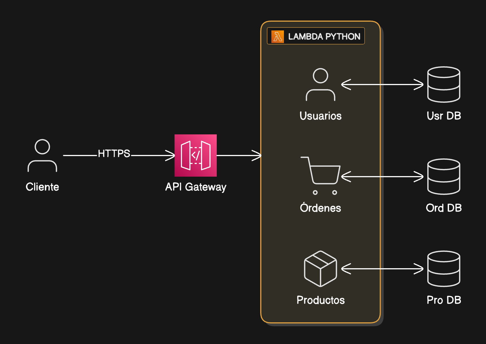

# Guía Completa: Sistema E-commerce Serverless

## Introducción

Esta guía te llevará paso a paso para construir un sistema de e-commerce completo usando AWS Lambda, DynamoDB, API Gateway y Python. El sistema incluye gestión de usuarios, productos y órdenes, con integración a FakerAPI para datos de prueba.



**Tecnologías:**
- AWS Lambda (Python 3.12)
- Amazon DynamoDB
- API Gateway
- FakerAPI

**Tiempo estimado:** 60-90 minutos

---

## Parte 1: Crear las Tablas en DynamoDB

### Tabla 1: Usuarios

1. Abre la consola de AWS y ve a **DynamoDB**
2. Click en **Crear tabla**
3. Configuración:
   - **Nombre de tabla**: `Usuarios`
   - **Clave de partición**: `id` (String)
   - **Configuración de tabla**: Capacidad bajo demanda
4. Expandir **Configuración adicional**
5. **Time to Live (TTL)**:
   - Habilitar TTL: ✓
   - **Atributo TTL**: `ttl`
6. Click en **Crear tabla**
7. Esperar hasta que el estado sea "Activa"

### Tabla 2: Productos

Repetir el proceso:
- **Nombre**: `Productos`
- **Clave de partición**: `id` (String)
- **TTL**: `ttl`

### Tabla 3: Ordenes

1. **Nombre de tabla**: `Ordenes`
2. **Clave de partición**: `id` (String)
3. **Clave de ordenamiento**: `fecha` (String)
4. **TTL**: `ttl`
5. Crear tabla

**Resultado esperado:** 3 tablas creadas y activas

---

## Parte 2: Crear la Función Lambda

### Paso 1: Crear la Función

1. Ve a **AWS Lambda**
2. Click en **Crear función**
3. Configuración:
   - **Nombre de función**: `ecommerce-api`
   - **Runtime**: Python 3.13
   - **Arquitectura**: x86_64
4. Click en **Crear función**

### Paso 2: Agregar el Código

1. En el editor de código, **selecciona todo** (Ctrl+A) y bórralo
2. Copia el código completo del artifact `lambda_function.py` 
3. Pega el código en el editor
4. Click en **Deploy**
5. Espera el mensaje "Changes deployed successfully"

### Paso 3: Configurar Timeout y Memoria

1. Pestaña **Configuración**
2. **Configuración general** → **Editar**
3. Cambiar:
   - **Tiempo de espera**: 30 segundos
   - **Memoria**: 256 MB
4. **Guardar**

### Paso 4: Configurar Permisos

1. Pestaña **Configuración** → **Permisos**
2. Click en el nombre del rol (abrirá IAM)
3. **Agregar permisos** → **Adjuntar políticas**
4. Buscar: `AmazonDynamoDBFullAccess`
5. Seleccionar y **Adjuntar política**

**Verificación:** El rol debe tener 2 políticas:
- AWSLambdaBasicExecutionRole
- AmazonDynamoDBFullAccess

---

## Parte 3: Configurar API Gateway (Simplificado)

### Paso 1: Crear la API

1. Ve a **API Gateway**
2. **Crear API**
3. Selecciona **API REST** → **Crear**
4. Configuración:
   - **Nombre**: `EcommerceAPI`
   - **Tipo de punto de enlace**: Regional
5. **Crear API**

### Paso 2: Crear Método ANY en la Raíz

1. Selecciona el recurso **/** (raíz)
2. **Acciones** → **Crear método**
3. Selecciona **ANY** del dropdown
4. Click en ✓
5. Configuración:
   - **Tipo de integración**: Función Lambda
   - ✅ **Usar integración de proxy de Lambda** (IMPORTANTE)
   - **Función Lambda**: `ecommerce-api`
6. **Guardar**
7. **Aceptar** dar permisos

### Paso 3: Crear Recurso Proxy

1. Con **/** seleccionado
2. **Acciones** → **Crear recurso**
3. Configuración:
   - **Nombre del recurso**: `proxy`
   - **Ruta del recurso**: `{proxy+}`
   - ✅ **Configurar como recurso de proxy**
4. **Crear recurso**
5. Se creará automáticamente con método **ANY**
6. Configuración del método:
   - **Función Lambda**: `ecommerce-api`
   - ✅ **Usar integración de proxy de Lambda**
7. **Guardar**
8. **Aceptar** permisos

### Paso 4: Desplegar la API

1. **Acciones** → **Implementar la API**
2. **Etapa de implementación**: [Nueva etapa]
3. **Nombre de la etapa**: `prod`
4. **Implementar**

### Paso 5: Copiar la URL

1. Verás la **URL de invocación** en la parte superior
2. Copia esta URL (ejemplo: `https://abc123xyz.execute-api.us-east-1.amazonaws.com/prod`)

**Estructura final en API Gateway:**
```
/
├── ANY
└── {proxy+}
    └── ANY
```

Esta configuración simple captura TODAS las rutas automáticamente.

---

## Parte 4: Probar el Sistema

### Prueba 1: Inicializar el Sistema

Abre tu terminal y ejecuta:

```bash
curl -X POST https://TU-API-URL/prod/inicializar
```

**Respuesta esperada:**
```json
{
  "message": "Sistema inicializado",
  "data": {
    "usuarios_cargados": 5,
    "productos_cargados": 10
  }
}
```

### Prueba 2: Ver Usuarios

```bash
curl https://TU-API-URL/prod/usuarios
```

**Respuesta esperada:**
```json
{
  "total": 5,
  "data": [
    {
      "id": "1",
      "firstname": "John",
      "lastname": "Doe",
      "email": "john@example.com",
      ...
    }
  ]
}
```

### Prueba 3: Ver Productos

```bash
curl https://TU-API-URL/prod/productos
```

**Respuesta esperada:**
```json
{
  "total": 10,
  "data": [...]
}
```

### Prueba 4: Crear una Orden

```bash
curl -X POST https://TU-API-URL/prod/ordenes \
  -H "Content-Type: application/json" \
  -d '{"usuario_id": "1", "productos_ids": ["1", "2", "3"]}'
```

**Respuesta esperada:**
```json
{
  "message": "Orden creada exitosamente",
  "data": {
    "id": "uuid-generado",
    "usuario_id": "1",
    "total": "2500.50",
    "items": [...]
  }
}
```

### Prueba 5: Ver Órdenes del Usuario

```bash
curl https://TU-API-URL/prod/ordenes/usuario/1
```

**Respuesta esperada:**
```json
{
  "total": 1,
  "data": [...]
}
```

### Prueba 6: Buscar Productos por Categoría

```bash
curl https://TU-API-URL/prod/productos/categoria/25
```

**Respuesta esperada:**
```json
{
  "categoria": "25",
  "total": 3,
  "data": [...]
}
```

---

## API Reference Completa

### Base URL
```
https://[TU-API-ID].execute-api.[REGION].amazonaws.com/prod
```

### Endpoints de Usuarios

#### Listar Todos los Usuarios
```bash
GET /usuarios
```

#### Obtener Usuario por ID
```bash
GET /usuarios/{id}
```

#### Cargar Usuarios desde API
```bash
POST /usuarios/cargar?cantidad=5
```

### Endpoints de Productos

#### Listar Todos los Productos
```bash
GET /productos
```

#### Obtener Producto por ID
```bash
GET /productos/{id}
```

#### Cargar Productos desde API
```bash
POST /productos/cargar?cantidad=10
```

#### Buscar por Categoría
```bash
GET /productos/categoria/{categoria}
```

### Endpoints de Órdenes

#### Listar Todas las Órdenes
```bash
GET /ordenes
```

#### Crear Nueva Orden
```bash
POST /ordenes
Content-Type: application/json

{
  "usuario_id": "1",
  "productos_ids": ["1", "2", "3"]
}
```

#### Obtener Orden por ID
```bash
GET /ordenes/{id}
```

#### Obtener Órdenes de un Usuario
```bash
GET /ordenes/usuario/{usuario_id}
```

### Endpoint de Sistema

#### Inicializar Datos
```bash
POST /inicializar
```

Carga 5 usuarios y 10 productos automáticamente.

---

## Script de Prueba Completo

Copia este script para probar todo el sistema:

```bash
#!/bin/bash

# Reemplaza con tu URL
API_URL="https://TU-API-ID.execute-api.us-east-1.amazonaws.com/prod"

echo "=== PRUEBA COMPLETA DEL SISTEMA E-COMMERCE ==="

echo -e "\n1. Inicializar sistema"
curl -X POST $API_URL/inicializar

echo -e "\n\n2. Total de usuarios:"
curl $API_URL/usuarios | jq '.total'

echo -e "\n3. Total de productos:"
curl $API_URL/productos | jq '.total'

echo -e "\n4. Ver IDs de usuarios:"
curl $API_URL/usuarios | jq '.data[] | {id: .id, nombre: .firstname}'

echo -e "\n5. Crear orden:"
curl -X POST $API_URL/ordenes \
  -H "Content-Type: application/json" \
  -d '{"usuario_id": "1", "productos_ids": ["1", "2", "3"]}' | jq

echo -e "\n6. Total de órdenes:"
curl $API_URL/ordenes | jq '.total'

echo -e "\n7. Órdenes del usuario 1:"
curl $API_URL/ordenes/usuario/1 | jq '.total'

echo -e "\n8. Productos con categoría 25:"
curl $API_URL/productos/categoria/25 | jq '.total'

echo -e "\n✅ PRUEBA COMPLETADA"
```

---

## Verificación de Datos en DynamoDB

### Ver Usuarios

1. Ve a **DynamoDB** → **Tablas** → **Usuarios**
2. **Explorar elementos de tabla**
3. Deberías ver 5 usuarios

### Ver Productos

1. **Tablas** → **Productos**
2. **Explorar elementos de tabla**
3. Deberías ver 10 productos

### Ver Órdenes

1. **Tablas** → **Ordenes**
2. **Explorar elementos de tabla**
3. Verás las órdenes creadas con toda la información

---

## Troubleshooting

### Error: "Missing Authentication Token"

**Causa:** El método o recurso no existe o la API no está desplegada.

**Solución:**
1. Verifica que existan los recursos `/` con ANY y `/{proxy+}` con ANY
2. **Acciones** → **Implementar la API** → **prod**
3. Intenta de nuevo

### Error: "Internal server error"

**Causa:** Error en el código Lambda o falta de permisos.

**Solución:**
1. Ve a **CloudWatch** → **Log groups** → `/aws/lambda/ecommerce-api`
2. Revisa el último log para ver el error específico
3. Verifica permisos de DynamoDB en IAM

### Error: "Usuario no encontrado" al crear orden

**Causa:** El usuario_id no existe.

**Solución:**
1. Lista usuarios disponibles: `GET /usuarios`
2. Usa un ID válido de la lista
3. O ejecuta `POST /inicializar` para cargar datos

### Las tablas están vacías

**Causa:** No se han cargado datos o el TTL eliminó los datos.

**Solución:**
```bash
curl -X POST https://TU-API-URL/prod/inicializar
```

### Error: AccessDeniedException en DynamoDB

**Causa:** Lambda no tiene permisos.

**Solución:**
1. IAM → Roles → [tu-lambda-role]
2. Adjuntar política: `AmazonDynamoDBFullAccess`

---

## Arquitectura del Sistema

```
┌─────────────┐
│   Cliente   │
└──────┬──────┘
       │ HTTPS
┌──────▼──────────┐
│  API Gateway    │
│  /              │
│  /{proxy+}      │
└──────┬──────────┘
       │
┌──────▼──────────┐
│  Lambda Python  │
│  - Usuarios     │
│  - Productos    │
│  - Órdenes      │
└─┬────┬────┬─────┘
  │    │    │
┌─▼─┐┌─▼─┐┌─▼──┐
│Usr││Pro││Ord │
│DB ││DB ││DB  │
└───┘└───┘└────┘
```

---

## Modelo de Datos

### Tabla Usuarios
- **id** (String, PK): Identificador único
- **firstname** (String): Nombre
- **lastname** (String): Apellido
- **email** (String): Email
- **phone** (String): Teléfono
- **birthday** (String): Fecha de nacimiento
- **gender** (String): Género
- **address** (Map): Dirección completa
- **created_at** (String): Fecha de creación
- **ttl** (Number): Time to live (30 días)

### Tabla Productos
- **id** (String, PK): Identificador único
- **name** (String): Nombre del producto
- **description** (String): Descripción
- **ean** (String): Código de barras
- **price** (Number): Precio con impuestos
- **net_price** (Number): Precio sin impuestos
- **taxes** (Number): Impuestos
- **image** (String): URL de imagen
- **categories** (List): Lista de categorías
- **stock** (Number): Inventario disponible
- **created_at** (String): Fecha de creación
- **ttl** (Number): Time to live (90 días)

### Tabla Ordenes
- **id** (String, PK): UUID único
- **fecha** (String, SK): Fecha de creación
- **usuario_id** (String): ID del usuario
- **usuario_nombre** (String): Nombre del usuario
- **usuario_email** (String): Email del usuario
- **items** (List): Lista de productos
  - producto_id
  - nombre
  - precio_unitario
  - cantidad
  - subtotal
- **total** (Number): Total de la orden
- **estado** (String): Estado (pendiente, enviado, etc.)
- **created_at** (String): Fecha de creación
- **ttl** (Number): Time to live (60 días)

---


## Costos Estimados

Para desarrollo/pruebas (nivel gratuito de AWS):
- **DynamoDB**: Incluido en capa gratuita (25GB, 200M requests/mes)
- **Lambda**: 1M requests gratis/mes, 400,000 GB-segundos
- **API Gateway**: 1M requests gratis los primeros 12 meses

**Costo mensual estimado después de capa gratuita:** $5-10 USD con uso moderado

---

## Recursos Adicionales

### Documentación Oficial
- [AWS Lambda Python](https://docs.aws.amazon.com/lambda/latest/dg/python-handler.html)
- [DynamoDB boto3](https://boto3.amazonaws.com/v1/documentation/api/latest/reference/services/dynamodb.html)
- [API Gateway](https://docs.aws.amazon.com/apigateway/)

### FakerAPI
- [Documentación](https://fakerapi.it/)
- Endpoints disponibles: persons, products, companies, books, images, texts, etc.


¡Felicitaciones por completar el sistema! 🎉
